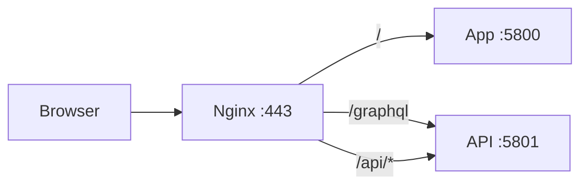

# Smart Furnish

Monorepo for the Smart Furnish admin dashboard (`app/`) and its NestJS API (`api/`).

## Deploy

Production deployment uses [PM2](https://pm2.keymetrics.io/) to run the built API and frontend, with [Nginx](https://nginx.org/) in front for `smartfurnish.ir`.

| Service | Port | Description |
|---------|------|-------------|
| App | `5800` | Vite production preview (serves the React build) |
| API | `5801` | NestJS GraphQL + REST API |

Users reach the site on **https://smartfurnish.ir**. Nginx routes `/` to the app and `/graphql` + `/api/` to the API.

### Prerequisites

On the server:

- Node.js 20+
- MongoDB
- MinIO (or compatible object storage)
- Nginx
- PM2 installed globally:

```sh
npm install -g pm2
```

### 1. Configure environment

#### API — `api/.env`

```sh
cp api/.env.example api/.env
```

Set production values. At minimum:

```env
NODE_ENV=production
PORT=5801
BASE_URL=https://smartfurnish.ir
APP_URL=https://smartfurnish.ir
API_PREFIX=api/v1

MONGODB_URI=mongodb://127.0.0.1:27017
MONGODB_DATABASE=smart-furnish

JWT_SECRET=<generate-a-long-random-secret>

GRAPHQL_PLAYGROUND=false
GRAPHQL_INTROSPECTION=false

MINIO_ENDPOINT=127.0.0.1
MINIO_PORT=9000
MINIO_USE_SSL=false
MINIO_ACCESS_KEY=<your-key>
MINIO_SECRET_KEY=<your-secret>
MINIO_BUCKET=smart-furnish
```

ZarinPal proxy URL and API key are configured in **System Settings → ZarinPal config** (`proxyBaseUrl`, `proxyApiKey`), not in `.env`.

`APP_URL` is used for payment callbacks and email links — set it to your public domain.

#### App — `app/.env`

```sh
cp app/.env.example app/.env
```

Set production values:

```env
PORT=5800
VITE_APP_URL=https://smartfurnish.ir
VITE_API_BASE_URL=https://smartfurnish.ir
VITE_ALLOWED_HOSTS=smartfurnish.ir,www.smartfurnish.ir
VITE_NODE_ENV=production
VITE_EXPOSE_VIA_NETWORK=true
```

`VITE_API_BASE_URL` is baked into the build. Use your public domain so browser requests (e.g. ZarinPal verify) go through Nginx.

Rebuild after changing any `VITE_*` variable.

### 2. Run deploy

From the repo root:

```sh
npm run deploy
```

This script:

1. Installs dependencies in `api/` and `app/`
2. Builds both packages
3. Starts (or restarts) both services with PM2

Direct access (for testing on the server):

| Service | URL |
|---------|-----|
| App | http://127.0.0.1:5800 |
| API | http://127.0.0.1:5801/graphql |

The app also proxies `/graphql` and `/api` to the API when accessed on port 5800 directly.

### 3. Manage PM2 services

```sh
npm run stop      # stop both services
npm run restart   # restart both services
npm run logs      # tail PM2 logs
pm2 status        # check process status
```

After the first deploy, PM2 persists the process list (`pm2 save` runs automatically). On server reboot:

```sh
pm2 resurrect
```

To start PM2 on boot (once per server):

```sh
pm2 startup
# run the command PM2 prints, then:
pm2 save
```

### 4. Update after `git pull`

```sh
git pull
npm run deploy
```

### Manual deploy steps

```sh
npm install --prefix api
npm install --prefix app
npm run build --prefix api
npm run build --prefix app
npm run start
```

---

## Nginx for smartfurnish.ir

A ready-made site config lives at [`deploy/nginx/smartfurnish.ir.conf`](deploy/nginx/smartfurnish.ir.conf).

### DNS

Point your domain to the server IP:

| Type | Name | Value |
|------|------|-------|
| A | `@` | `<server-ip>` |
| A | `www` | `<server-ip>` |

### Install the site config

```sh
sudo cp deploy/nginx/smartfurnish.ir.conf /etc/nginx/sites-available/smartfurnish.ir
sudo ln -sf /etc/nginx/sites-available/smartfurnish.ir /etc/nginx/sites-enabled/smartfurnish.ir
```

Remove the default site if it conflicts:

```sh
sudo rm -f /etc/nginx/sites-enabled/default
```

### SSL with Let's Encrypt

Install certbot if needed:

```sh
sudo apt update
sudo apt install -y certbot python3-certbot-nginx
```

Obtain a certificate (Nginx must be running; HTTP block in the config handles the ACME challenge path):

```sh
sudo certbot --nginx -d smartfurnish.ir -d www.smartfurnish.ir
```

Certbot updates the `ssl_certificate` paths in the config. Renewal is automatic via systemd timer.

Test and reload:

```sh
sudo nginx -t
sudo systemctl reload nginx
```

### How traffic is routed



- **`/`** → React app (PM2 / port 5800)
- **`/graphql`** → GraphQL + WebSocket subscriptions (PM2 / port 5801)
- **`/api/`** → REST endpoints e.g. payment verify (PM2 / port 5801)

### Firewall

Only expose HTTP/HTTPS publicly. Keep app/API ports local:

```sh
sudo ufw allow OpenSSH
sudo ufw allow 'Nginx Full'
sudo ufw enable
```

Ports `5800` and `5801` should bind to `127.0.0.1` only (default when Nginx is the public entry point).

---

## Development

- **API**: `npm run start:dev:transpile --prefix api` (default port `4000`)
- **App**: `npm run dev --prefix app` (default port `8080`, proxies `/graphql` to the API)

See `api/.env.example` and `app/.env.example` for local development defaults.
